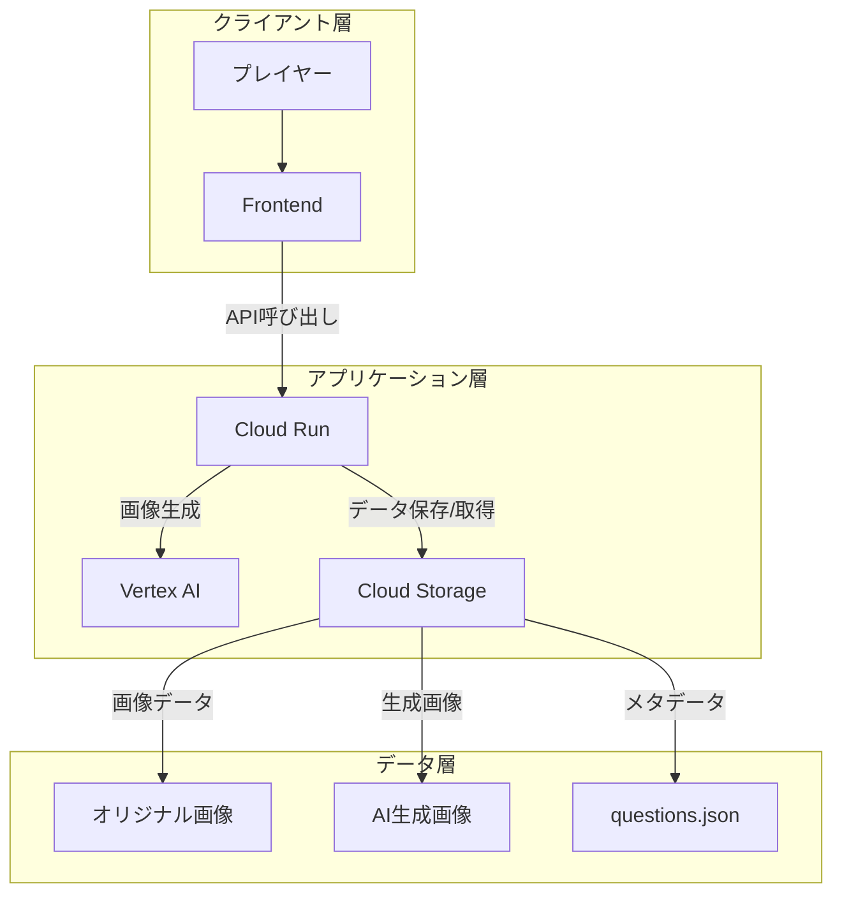

# AI画像ゲーム システム設計書

## 📋 システム概要

AI生成画像を活用したクイズゲームのバックエンドシステム

### プロジェクトの目的

- オリジナル画像とAI生成画像を使用したクイズゲームの提供
- Google Cloud AIサービスを活用した画像生成
- スケーラブルなバックエンドAPIの実現

## 🏗 システムアーキテクチャ



## 🔧 技術スタック

### バックエンド

- 言語：Go 1.22.5
- フレームワーク：標準ライブラリ

### クラウドサービス

| サービス | 用途 | 選定理由 |
|---------|------|---------|
| Cloud Run | APIサーバー | スケーラビリティ、コスト効率 |
| Vertex AI | 画像生成 | 高品質な画像生成、APIの安定性 |
| Cloud Storage | 画像・メタデータ保存 | 大容量データの効率的な管理 |

## 📡 API仕様

### 1. 画像アップロードAPI

```yaml
POST /api/v1/upload
Content-Type: multipart/form-data

リクエスト:
  - file: バイナリ（画像ファイル）
  - metadata: JSON（タイトル、説明等）

レスポンス:
  - image_id: string
  - storage_url: string
  - status: string
```

### 2. クイズ取得API

```yaml
GET /api/v1/questions
Content-Type: application/json

レスポンス:
  - questions: Question[]
    - id: string
    - original_image: string
    - fake_images: string[]
    - correct_index: number
```

## 🔒 セキュリティ設計

### データ保護

- Cloud Storageでの暗号化
- 署名付きURLによるアクセス制御
- Cloud KMSによる鍵管理

### アクセス制御

- Cloud IAMによる権限管理
- APIキーによる認証
- レート制限の実装

## 💾 データ構造

### Cloud Storageバケット構成

```bash
zenn-ai-hackathon-2501/
├── original/           # オリジナル画像
├── generated/          # AI生成画像
└── metadata/
    └── questions.json  # クイズデータ
```

### クイズデータ（questions.json）

```json
{
  "questions": [
    {
      "id": "quiz_001",
      "original_image": "original/image1.jpg",
      "fake_images": [
        "generated/image1_fake1.jpg",
        "generated/image1_fake2.jpg"
      ],
      "correct_index": 0,
      "created_at": "2024-03-20T10:00:00Z"
    }
  ]
}
```

## 📈 パフォーマンス最適化

### キャッシュ戦略

- Cloud CDNの活用
- 画像のキャッシュヘッダー設定
- メタデータの適切なキャッシュ制御

### 並行処理

- 画像生成の非同期処理
- バッチ処理による効率化
- エラーハンドリングとリトライ

## 🚀 デプロイメント

### CI/CD

- GitHub Actionsによる自動デプロイ
- テスト自動化
- 段階的なロールアウト

### 監視

- Cloud Monitoringによるメトリクス収集
- Cloud Loggingによる監査ログ
- アラート設定

## 📝 開発ガイドライン

### コーディング規約

- Goの標準規約に準拠
- エラーハンドリングの統一
- ログ出力の標準化

### テスト戦略

- ユニットテスト
- 統合テスト
- 負荷テスト
