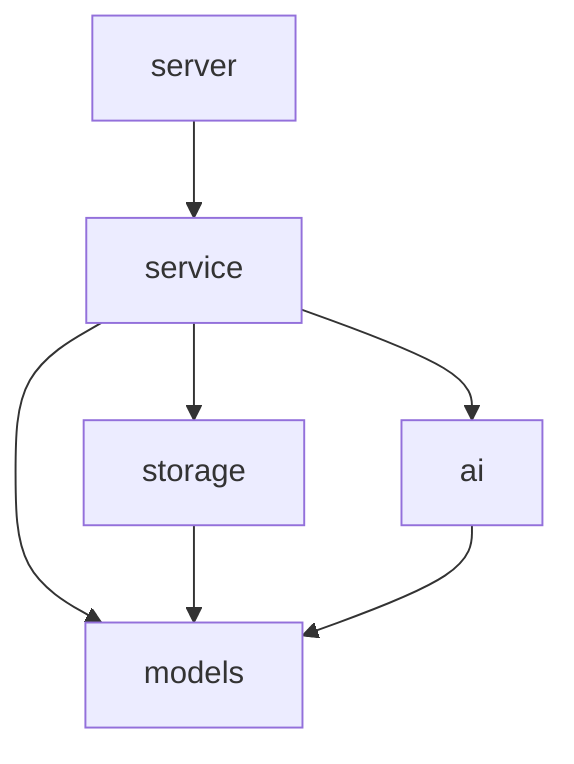

# アーキテクチャ設計

## システム概要

AI Art Quizは、作品の解釈を通じて芸術への理解を深めるクイズゲームのバックエンドシステムです。
マルチモーダルAIを活用して、作品に対する代替的な解釈を生成します。

## アーキテクチャの特徴

1. クリーンアーキテクチャの採用
   - 依存関係の方向を内側に向ける
   - ビジネスロジックの独立性を確保
   - テスト容易性の向上

2. マイクロサービス指向
   - 独立したデプロイ
   - スケーラビリティの確保
   - 責務の明確な分離

## コンポーネント構成

```
internal/
├── ai/          # AI関連の実装
│   ├── client.go
│   └── client_test.go
├── config/      # 設定管理
│   ├── config.go
│   └── config_test.go
├── models/      # ドメインモデル
│   └── quiz.go
├── server/      # HTTPサーバー
│   ├── server.go
│   └── server_test.go
├── service/     # ビジネスロジック
│   ├── quiz.go
│   └── quiz_test.go
└── storage/     # データストレージ
    ├── storage.go
    └── storage_test.go
```

## レイヤー構造

1. プレゼンテーション層 (`server/`)
   - HTTPリクエストの処理
   - レスポンスの生成
   - バリデーション

2. ビジネスロジック層 (`service/`)
   - クイズの生成
   - 解釈の管理
   - スコアリング

3. データアクセス層 (`storage/`)
   - 画像の保存
   - メタデータの管理
   - キャッシュ制御

4. 外部サービス層 (`ai/`)
   - Vertex AIとの通信
   - プロンプトの管理
   - エラーハンドリング

## 依存性の管理



## データフロー

1. クイズ作成フロー
   ```mermaid
   sequenceDiagram
       Client->>Server: POST /upload
       Server->>Service: CreateQuiz()
       Service->>Storage: SaveImage()
       Service->>AI: GenerateInterpretation()
       Service->>Storage: SaveQuiz()
       Server->>Client: Quiz Response
   ```

2. クイズ取得フロー
   ```mermaid
   sequenceDiagram
       Client->>Server: GET /quiz/{id}
       Server->>Service: GetQuiz()
       Service->>Storage: GetQuiz()
       Service->>Service: RandomizeInterpretations()
       Server->>Client: Quiz Response
   ```

## セキュリティ設計

1. 認証・認可
   - Cloud Run IAM
   - サービスアカウント

2. データ保護
   - Cloud Storage暗号化
   - セキュアな通信

3. 入力検証
   - ファイルタイプ
   - サイズ制限
   - XSS対策

## スケーラビリティ

1. 水平スケーリング
   - Cloud Runの自動スケーリング
   - ステートレスな設計

2. パフォーマンス最適化
   - 画像の最適化
   - キャッシュ戦略
   - 非同期処理

## 監視と運用

1. ロギング
   - Cloud Logging
   - 構造化ログ
   - エラートラッキング

2. メトリクス
   - レイテンシー
   - エラーレート
   - リソース使用率

3. アラート
   - エラー閾値
   - リソース枯渇
   - 異常検知

## 今後の展開

1. 機能拡張
   - ユーザー管理
   - ソーシャル機能
   - 統計分析

2. 技術的改善
   - キャッシュ層の追加
   - CDNの導入
   - バッチ処理の最適化
