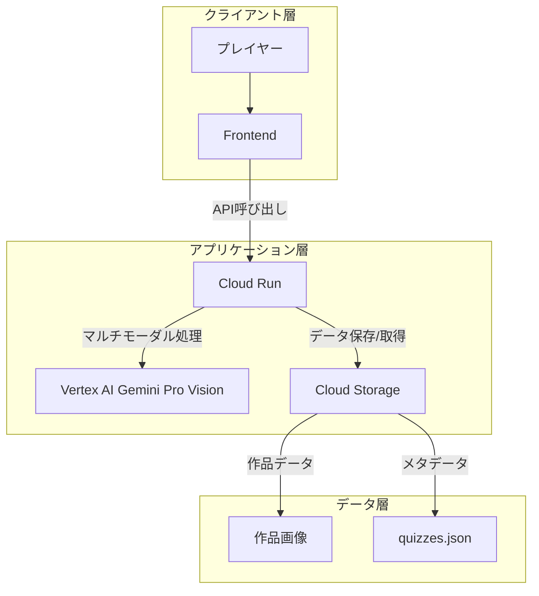

# AI画像ゲーム システム設計書

## 📋 システム概要

作品とその解釈を組み合わせたマルチモーダルクイズゲームのバックエンドシステム

### プロジェクトの目的

- 作品に込められた作者の思いを理解する体験の提供
- Vertex AI (Gemini Pro Vision)を活用した説得力のある解釈の生成

## 🏗 システムアーキテクチャ



## 🔧 コンポーネント構成

### 1. APIサーバー (`cmd/server/main.go`)
- HTTPリクエストの受付とルーティング
- リクエストの検証とエラーハンドリング
- レスポンスの整形と返却

### 2. クイズサービス (`internal/service/quiz.go`)
- クイズデータの生成・管理
- 作品と作者コメントの組み合わせ処理
- 回答の検証とスコア管理

### 3. AIクライアント (`internal/ai/client.go`)
- Gemini Pro Visionモデルとの通信
- 画像とテキストの統合的理解
- コンテキストを考慮した解釈生成

### 4. データモデル (`internal/models/types.go`)
```go
type Quiz struct {
    ID            string    `json:"id"`
    ImagePath     string    `json:"image_path"`
    RealComment   string    `json:"real_comment"`    // 本物の作者のコメント
    FakeComment   string    `json:"fake_comment"`    // AIが生成したコメント
    CreatedAt     time.Time `json:"created_at"`
}
```

## 🔧 技術スタック

### バックエンド

- 言語：Go 1.22.5
- フレームワーク：標準ライブラリ

### クラウドサービス

| サービス | 用途 | 選定理由 |
|---------|------|---------|
| Cloud Run | APIサーバー | スケーラビリティ、コスト効率 |
| Vertex AI | 画像生成 | 高品質な画像生成、APIの安定性 |
| Cloud Storage | 画像・メタデータ保存 | 大容量データの効率的な管理 |

## 📡 API仕様

### 1. クイズ作成 API
```yaml
POST /upload
Content-Type: multipart/form-data

リクエスト:
  - file: バイナリ（画像ファイル）
  - comment: テキスト（作者のコメント）

レスポンス:
{
    "quiz_id": "xxx",
    "image_path": "/images/xxx.jpg",
    "real_comment": "作者のコメント",
    "fake_comment": "AIが生成したコメント"
}
```

### 2. クイズ取得 API
```yaml
GET /quiz/{id}
Content-Type: application/json

レスポンス:
{
    "quiz_id": "xxx",
    "image_path": "/images/xxx.jpg",
    "comments": [
        "コメント1",  // 本物か偽物かはランダムに並び替え
        "コメント2"
    ]
}
```

## 🔒 セキュリティ設計

### データ保護

- Cloud Storageでの暗号化
- 署名付きURLによるアクセス制御
- Cloud KMSによる鍵管理

### アクセス制御

- Cloud IAMによる権限管理
- APIキーによる認証
- レート制限の実装

## 💾 データ構造

### Cloud Storageバケット構成
```bash
zenn-ai-hackathon-2501/
├── images/            # オリジナル画像
└── metadata/
    └── quizzes.json  # クイズデータ
```

### クイズデータ（quizzes.json）
```json
{
  "quizzes": [
    {
      "id": "quiz_001",
      "image_path": "images/image1.jpg",
      "real_comment": "この作品では、都市の喧騒の中に潜む静寂を表現しました。光と影の対比を通じて...",
      "fake_comment": "都市開発と自然保護の葛藤をテーマに、建築物と緑地の境界線を捉えました...",
      "created_at": "2024-03-20T10:00:00Z"
    }
  ]
}
```

## 📈 パフォーマンス最適化

### キャッシュ戦略

- Cloud CDNの活用
- 画像のキャッシュヘッダー設定
- メタデータの適切なキャッシュ制御

### 並行処理

- 画像生成の非同期処理
- バッチ処理による効率化
- エラーハンドリングとリトライ

## 🚀 デプロイメント

### CI/CD

- GitHub Actionsによる自動デプロイ
- テスト自動化
- 段階的なロールアウト

### 監視

- Cloud Monitoringによるメトリクス収集
- Cloud Loggingによる監査ログ
- アラート設定

## 📝 開発ガイドライン

### コーディング規約

- Goの標準規約に準拠
- エラーハンドリングの統一
- ログ出力の標準化

### テスト戦略

- ユニットテスト
- 統合テスト
- 負荷テスト

## 🔄 処理フロー詳細

1. クイズ作成フロー
   ```mermaid
   sequenceDiagram
       Client->>+Server: 作品画像・作者コメントのアップロード
       Server->>+Storage: 画像の保存
       Server->>+Gemini: 画像・コメント解析
       Gemini->>-Server: 新しい解釈の生成
       Server->>Storage: クイズデータの保存
       Server->>-Client: クイズID・結果の返却
   ```

2. クイズ取得フロー
   ```mermaid
   sequenceDiagram
       Client->>+Server: クイズIDでリクエスト
       Server->>+Storage: データ取得
       Storage->>-Server: クイズデータ
       Server->>Server: コメントのシャッフル
       Server->>-Client: 画像・コメント返却
   ```
